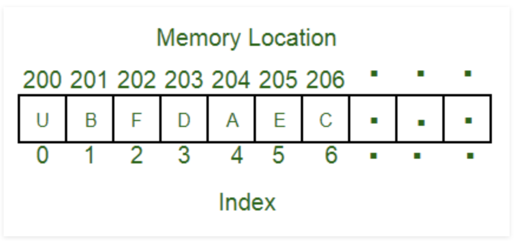
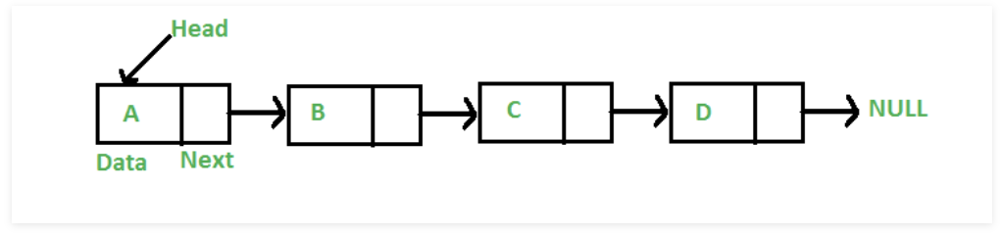
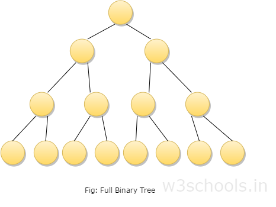
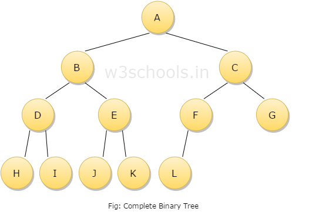

# Data Structures

## Arrays
**Array:** An array is a collection of items stored at contiguous memory locations. The idea is to store multiple items of the same type together. This makes it easier to calculate the position of each element by simply adding an offset to a base value, i.e., the memory location of the first element of the array (generally denoted by the name of the array).

## Linked List
**Linked Lists:** Like arrays, Linked List is a linear data structure. Unlike arrays, linked list elements are not stored at a contiguous location; the elements are linked using pointers.

## Stack 

## Queues

## Hash Tables 

## Sets 
A Set is an abstract data type that can store certain values, without any particular order, and no repeated values. It is a computer implementation of the mathematical concept of a finite Set. From Wikipedia

The Set data structure is usually used to test whether elements belong to set of values. Rather then only containing elements, Sets are more used to perform operations on multiple values at once with methods such as union, intersect, etc…

Complexity
Average	 	 	 
Access	Search	Insertion	Deletion
-	O(n)	O(n)	O(n)
## Binary Trees 
A binary tree is a special type of tree in which every node or vertex has either no child node or one child node or two child nodes. A binary tree is an important class of a tree data structure in which a node can have at most two children.

Child node in a binary tree on the left is termed as 'left child node' and node in the right is termed as the 'right child node.'
### type of binary tree
* full binary tree 

* complete binary tree 

## Tries
Trie: Trie is an efficient information reTrieval data structure. Using Trie, search complexities can be brought to an optimal limit (key length). If we store keys in the binary search tree, a well-balanced BST will need time proportional to M * log N, where M is maximum string length and N is the number of keys in the tree. Using Trie, we can search the key in O(M) time. However, the penalty is on Trie storage requirements.

## Balancing Binary Trees (AVL Tree)
Most of the BST operations (e.g., search, max, min, insert, delete.. etc) take O(h) time where h is the height of the BST. The cost of these operations may become O(n) for a skewed Binary tree. If we make sure that height of the tree remains O(Logn) after every insertion and deletion, then we can guarantee an upper bound of O(Logn) for all these operations. The height of an AVL tree is always O(Logn) where n is the number of nodes in the tree (See this video lecture for proof).

