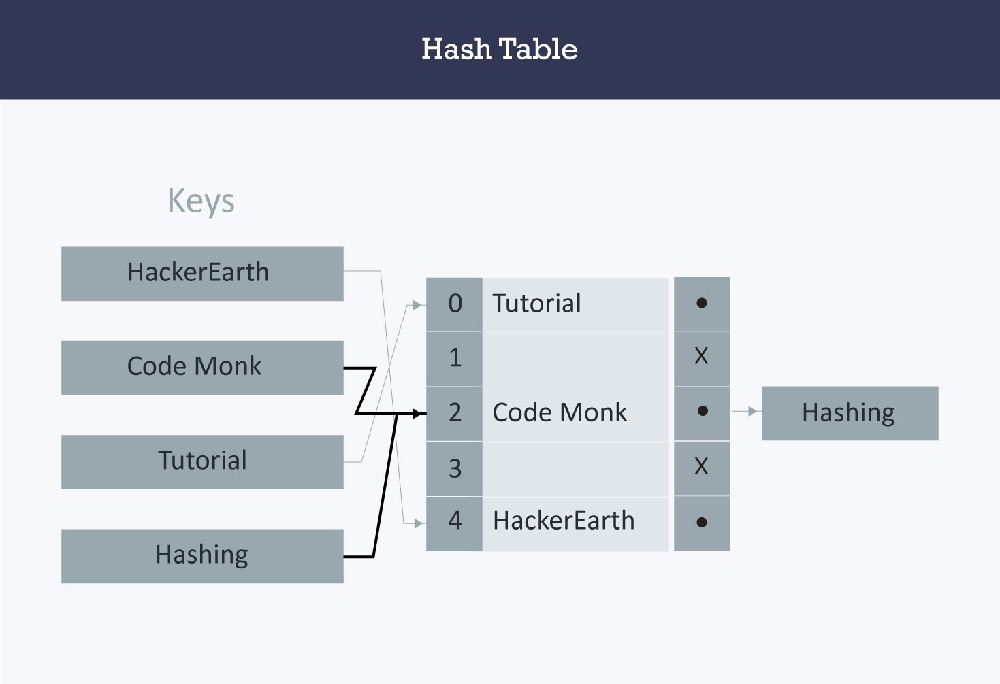

# Data Structures

## Arrays
**Array:** An array is a collection of items stored at contiguous memory locations. The idea is to store multiple items of the same type together. This makes it easier to calculate the position of each element by simply adding an offset to a base value, i.e., the memory location of the first element of the array (generally denoted by the name of the array).

## Linked List
**Linked Lists:** Like arrays, Linked List is a linear data structure. Unlike arrays, linked list elements are not stored at a contiguous location; the elements are linked using pointers.

## Stack 
A stack is a container of objects that are inserted and removed according to the last-in first-out (LIFO) principle. In the pushdown stacks only two operations are allowed: push the item into the stack, and pop the item out of the stack. A stack is a limited access data structure - elements can be added and removed from the stack only at the top. push adds an item to the top of the stack, pop removes the item from the top. A helpful analogy is to think of a stack of books; you can remove only the top book, also you can add a new book on the top.

## Queues
A queue is a container of objects (a linear collection) that are inserted and removed according to the first-in first-out (FIFO) principle. An excellent example of a queue is a line of students in the food court of the UC. New additions to a line made to the back of the queue, while removal (or serving) happens in the front. In the queue only two operations are allowed enqueue and dequeue. Enqueue means to insert an item into the back of the queue, dequeue means removing the front item. The picture demonstrates the FIFO access.
The difference between stacks and queues is in removing. In a stack we remove the item the most recently added; in a queue, we remove the item the least recently added.

## Hash Tables 

Hash Table is a data structure which stores data in an associative manner. In a hash table, data is stored in an array format, where each data value has its own unique index value. Access of data becomes very fast if we know the index of the desired data.
Thus, it becomes a data structure in which insertion and search operations are very fast irrespective of the size of the data. Hash Table uses an array as a storage medium and uses hash technique to generate an index where an element is to be inserted or is to be located from.

## Sets 
A Set is an abstract data type that can store certain values, without any particular order, and no repeated values. It is a computer implementation of the mathematical concept of a finite Set. From Wikipedia

The Set data structure is usually used to test whether elements belong to set of values. Rather then only containing elements, Sets are more used to perform operations on multiple values at once with methods such as union, intersect, etc…

Complexity
Average	 	 	 
Access	Search	Insertion	Deletion
-	O(n)	O(n)	O(n)
## Binary Trees 
A binary tree is a special type of tree in which every node or vertex has either no child node or one child node or two child nodes. A binary tree is an important class of a tree data structure in which a node can have at most two children.

Child node in a binary tree on the left is termed as 'left child node' and node in the right is termed as the 'right child node.'
### type of binary tree
* full binary tree 

* complete binary tree 

## Tries
Trie: Trie is an efficient information reTrieval data structure. Using Trie, search complexities can be brought to an optimal limit (key length). If we store keys in the binary search tree, a well-balanced BST will need time proportional to M * log N, where M is maximum string length and N is the number of keys in the tree. Using Trie, we can search the key in O(M) time. However, the penalty is on Trie storage requirements.

## Balancing Binary Trees (AVL Tree)
